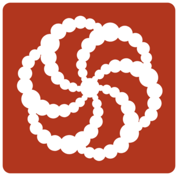

## My CodeWars katas

## Description

This repository contains my completed CodeWars katas. CodeWars is a platform that offers coding challenges (katas) of varying difficulty levels to help developers improve their coding skills. Each kata is a unique coding problem that requires solving using different programming techniques.

## CodeWars Ranking System

CodeWars has a ranking system based on the user's performance in solving katas. The ranking is represented by "kyu" levels. The kyu levels start from 8 kyu, which is the easiest, and progress towards 1 kyu, which is the most difficult. As you solve more katas, you will improve your ranking and move up the kyu ladder.

Here's an overview of the kyu levels:

- **8 kyu**: Beginners. Simple challenges that require basic programming skills.
- **7 kyu**: Novices. Slightly more complex problems that involve more intricate logic.
- **6 kyu**: Competent. Challenges that require a good understanding of programming concepts.
- **5 kyu**: Proficient. Problems that demand efficient algorithms and data structures.
- **4 kyu**: Expert. Complex tasks that test your ability to handle advanced programming concepts.
- **3 kyu**: Master. Difficult challenges that require creativity and advanced problem-solving skills.
- **2 kyu**: Grandmaster. Extremely tough problems for highly skilled developers.
- **1 kyu**: Legend. The most difficult challenges reserved for coding masters.

As you solve katas and gain points, your ranking will improve. CodeWars provides an excellent way to gauge your progress and learn from other developers' solutions.